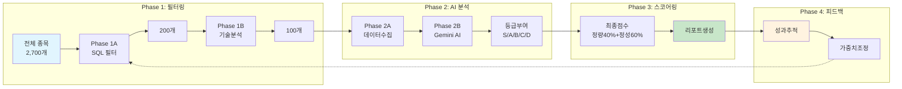
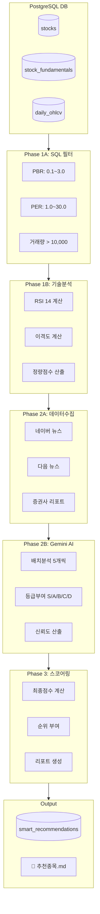
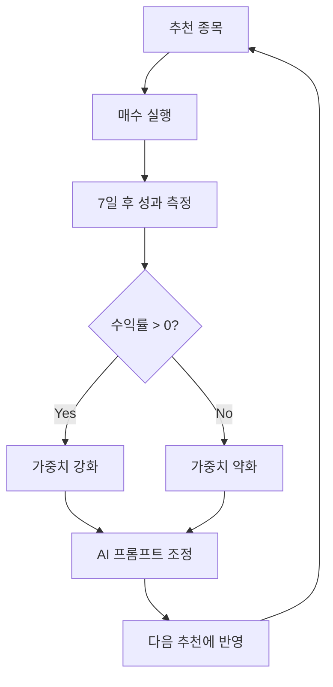

# 신규종목추천 시스템 설계 문서

**작성일**: 2025-11-27 14:08:02
**버전**: 1.0
**작성자**: Claude AI + wonny

---

## 1. 시스템 개요

### 1.1 목적

신규종목추천 시스템은 한국 주식 시장에서 **보유하고 있지 않은 종목 중 투자 가치가 높은 종목**을 AI 기반으로 발굴하는 자동화 시스템입니다.

### 1.2 핵심 목표

- **S등급 종목 발굴**: 극심한 저평가 + 기술적 반등 신호가 있는 종목
- **정량 + 정성 분석**: 밸류에이션 + AI 분석 통합 점수화
- **실행 효율성**: 전체 파이프라인 10분 이내 완료
- **자동화**: 매일 자동 실행 가능한 구조

### 1.3 핵심 지표

| 지표 | 설명 | 목표 범위 |
|:---|:---|:---|
| PBR | 주가순자산비율 | 0.1 ~ 0.5 (극심한 저평가) |
| PER | 주가수익비율 | 1 ~ 10 (수익 대비 저평가) |
| RSI(14) | 상대강도지수 | 20 ~ 50 (과매도~중립) |
| 이격도 | 이동평균 대비 | 20일 < 115%, 60일 < 120% |

---

## 2. 시스템 아키텍처

### 2.1 4단계 파이프라인



**ASCII 버전:**
```
┌─────────────────────────────────────────────────────────────────────┐
│                    신규종목추천 파이프라인                              │
├─────────────────────────────────────────────────────────────────────┤
│                                                                     │
│  ┌──────────┐    ┌──────────┐    ┌──────────┐    ┌──────────┐     │
│  │ Phase 1A │ -> │ Phase 1B │ -> │ Phase 2  │ -> │ Phase 3  │     │
│  │ SQL필터  │    │ 기술분석 │    │ AI분석   │    │ 스코어링 │     │
│  └──────────┘    └──────────┘    └──────────┘    └──────────┘     │
│       │              │              │              │               │
│   2,700개         200개           100개          100개            │
│   전체종목       PBR/PER        RSI/이격도      최종점수           │
│                  필터링          필터링         + 리포트           │
│                                                                     │
└─────────────────────────────────────────────────────────────────────┘
```

### 2.2 데이터 흐름



**ASCII 버전:**
```
[PostgreSQL DB]
     │
     ├─ stocks (종목 마스터)
     ├─ stock_fundamentals (PBR/PER/시총)
     ├─ daily_ohlcv (일별 가격 데이터)
     │
     v
[Phase 1A: SQL 필터]
     │
     ├─ PBR: 0.1 ~ 3.0
     ├─ PER: 1.0 ~ 30.0
     ├─ 거래량: > 10,000
     │
     v
[Phase 1B: 기술적 분석]
     │
     ├─ RSI(14) 계산
     ├─ 이격도(20일/60일) 계산
     ├─ 정량 점수 산출
     │
     v
[Phase 2A: 데이터 수집]
     │
     ├─ 네이버 뉴스 API
     ├─ 다음 뉴스 API
     ├─ 증권사 리포트
     │
     v
[Phase 2B: Gemini AI 분석]
     │
     ├─ 5개 종목씩 배치 분석
     ├─ S/A/B/C/D 등급 부여
     ├─ 신뢰도(confidence) 산출
     │
     v
[Phase 3: 스코어링]
     │
     ├─ 최종점수 = 정량(40%) + 정성(60%)
     ├─ 순위 부여
     ├─ 마크다운 리포트 생성
     │
     v
[Output]
     ├─ smart_recommendations 테이블
     └─ reports/new_stock/추천종목_YYYY-MM-DD_HHMM.md
```

---

## 3. Phase별 상세 설계

### 3.1 Phase 1A: SQL 기반 1차 필터

**파일**: `신규종목추천/src/phase1/filter_phase1a.py`

**목적**: 전체 ~2,700개 종목에서 밸류에이션 기준으로 200개 후보 선정

**필터 조건**:
```sql
SELECT s.stock_code, s.stock_name, f.pbr, f.per, f.market_cap
FROM stocks s
JOIN stock_fundamentals f ON s.stock_code = f.stock_code
WHERE f.pbr BETWEEN 0.1 AND 3.0
  AND f.per BETWEEN 1.0 AND 30.0
  AND f.market_cap > 0
  -- 보유 종목 제외
  AND s.stock_code NOT IN (SELECT stock_code FROM stock_assets WHERE quantity > 0)
ORDER BY f.pbr ASC
LIMIT 200
```

**설계 원칙**:
- PBR 오름차순 정렬로 저평가 종목 우선
- 보유 종목 자동 제외
- 상장폐지 종목 제외

### 3.2 Phase 1B: 기술적 지표 필터

**파일**: `신규종목추천/src/phase1/filter_phase1b.py`

**목적**: 기술적 분석으로 100개 최종 후보 선정 + 정량 점수 계산

**계산 지표**:

```python
# RSI(14) 계산
def calculate_rsi(prices, period=14):
    delta = prices.diff()
    gain = (delta.where(delta > 0, 0)).rolling(window=period).mean()
    loss = (-delta.where(delta < 0, 0)).rolling(window=period).mean()
    rs = gain / loss
    return 100 - (100 / (1 + rs))

# 이격도 계산
def calculate_disparity(close, ma):
    return (close / ma) * 100
```

**필터 조건**:
- RSI(14): 20 ~ 80 (극단적 과매수/과매도 제외)
- 이격도(20일): <= 115% (과열 제외)
- 이격도(60일): <= 120% (과열 제외)

**정량 점수 공식**:
```python
quant_score = (
    pbr_score * 0.3 +      # PBR 낮을수록 고점수
    per_score * 0.3 +      # PER 낮을수록 고점수
    rsi_score * 0.2 +      # RSI 30~50 구간 고점수
    disparity_score * 0.2  # 이격도 낮을수록 고점수
)
```

### 3.3 Phase 2A: 배치 데이터 수집

**파일**: `신규종목추천/src/phase2/batch_collector.py`

**목적**: 100개 종목의 뉴스, 리포트, 컨센서스 데이터 수집

**수집 데이터**:
| 데이터 | 소스 | Rate Limit |
|:---|:---|:---|
| 뉴스 | 네이버/다음 API | 30 calls/min |
| 리포트 | FnGuide, WiseReport | 12 calls/min |
| 컨센서스 | 증권사 API | 12 calls/min |

**캐시 전략**:
```python
# 6시간 TTL 캐시
cache_key = f"{stock_code}:{data_type}:{date}"
if cache.get(cache_key):
    return cache.get(cache_key)
```

### 3.4 Phase 2B: Gemini AI 분석

**파일**: `신규종목추천/src/phase2/gemini_analyzer.py`

**목적**: 100개 종목을 5개씩 배치로 AI 분석

**모델**: `gemini-2.0-flash`

**배치 전략**:
```
100개 종목 ÷ 5개/배치 = 20회 API 호출
각 호출 간격: 10초 (Rate Limit)
총 예상 시간: ~3분
```

**프롬프트 구조**:
```
[종목 정보]
- 정량 지표: PBR, PER, RSI, 이격도
- 최근 뉴스: 5개
- 컨센서스: 목표가, 매수/중립/매도

[등급 기준]
- S등급: PBR 0.3 이하 AND PER 5 이하
- A등급: PBR 0.5 이하 OR PER 7 이하
- B등급: PBR 1.0 이하 OR PER 15 이하
- C등급: 특별한 매력 없음
- D등급: 하락 리스크 존재

[출력 형식]
JSON 배열 (code, grade, key_material, risk, confidence)
```

**등급별 기본 점수**:
| 등급 | 기본 점수 | 신뢰도 가중 후 |
|:---:|:---:|:---:|
| S | 100 | 70~100 |
| A | 80 | 56~80 |
| B | 60 | 42~60 |
| C | 40 | 28~40 |
| D | 20 | 14~20 |

### 3.5 Phase 3: 최종 스코어링

**파일**: `신규종목추천/src/phase3/scorer.py`

**최종 점수 공식**:
```python
final_score = quant_score * 0.4 + qual_score * 0.6

# qual_score 계산
grade_score = {'S': 100, 'A': 80, 'B': 60, 'C': 40, 'D': 20}
confidence_factor = 0.7 + (ai_confidence * 0.3)
qual_score = grade_score[ai_grade] * confidence_factor
```

**점수 분포 예시**:
| 등급 | 정량 | 정성 | 최종 |
|:---:|:---:|:---:|:---:|
| S (신뢰도 0.7) | 37 | 91 | 69.6 |
| A (신뢰도 0.7) | 35 | 72.8 | 57.7 |
| B (신뢰도 0.6) | 33 | 52.8 | 44.9 |

---

## 4. 데이터베이스 스키마

### 4.1 핵심 테이블

**smart_recommendations** (추천 결과 저장):
```sql
CREATE TABLE smart_recommendations (
    id SERIAL PRIMARY KEY,
    stock_code VARCHAR(10) NOT NULL,
    stock_name VARCHAR(100),
    recommendation_date DATE NOT NULL,
    batch_id UUID NOT NULL,

    -- 정량 지표
    pbr DECIMAL(10,4),
    per DECIMAL(10,4),
    market_cap BIGINT,
    volume BIGINT,
    close_price INT,
    rsi_14 DECIMAL(10,4),
    disparity_20 DECIMAL(10,4),
    disparity_60 DECIMAL(10,4),

    -- 수급
    pension_net_buy BIGINT,
    institution_net_buy BIGINT,
    foreign_net_buy BIGINT,

    -- 점수
    quant_score DECIMAL(10,4),
    qual_score DECIMAL(10,4),
    final_score DECIMAL(10,4),

    -- AI 분석
    ai_grade VARCHAR(1),
    ai_confidence DECIMAL(5,4),
    ai_key_material TEXT,
    ai_risk_factor TEXT,

    -- 순위
    rank_in_batch INT,

    created_at TIMESTAMP DEFAULT NOW(),

    UNIQUE(stock_code, recommendation_date, batch_id)
);
```

**smart_run_history** (실행 이력):
```sql
CREATE TABLE smart_run_history (
    id SERIAL PRIMARY KEY,
    batch_id UUID UNIQUE NOT NULL,
    started_at TIMESTAMP DEFAULT NOW(),
    finished_at TIMESTAMP,
    status VARCHAR(20) DEFAULT 'running',

    -- Phase별 결과
    phase1a_filtered INT,
    phase1b_filtered INT,
    phase2_collected INT,
    phase3_scored INT,

    -- 완료 시각
    phase1a_completed_at TIMESTAMP,
    phase1b_completed_at TIMESTAMP,
    phase2_completed_at TIMESTAMP,
    phase3_completed_at TIMESTAMP
);
```

### 4.2 의존 테이블

| 테이블 | 용도 | 데이터 소스 |
|:---|:---|:---|
| stocks | 종목 마스터 | KRX |
| stock_fundamentals | PBR/PER/시총 | pykrx |
| daily_ohlcv | 일별 가격 | FinanceDataReader |
| stock_assets | 보유 종목 | 수동 입력 |

---

## 5. 설정 관리

### 5.1 설정 파일 구조

**파일**: `신규종목추천/config/settings.py`

```python
@dataclass
class Phase1AConfig:
    pbr_min: float = 0.1
    pbr_max: float = 3.0
    per_min: float = 1.0
    per_max: float = 30.0
    min_volume: int = 10_000
    max_candidates: int = 200

@dataclass
class Phase1BConfig:
    rsi_min: float = 20.0
    rsi_max: float = 80.0
    disparity_20_max: float = 115.0
    disparity_60_max: float = 120.0
    max_candidates: int = 100

@dataclass
class Phase2BConfig:
    model_name: str = 'gemini-2.0-flash'
    batch_size: int = 5
    rate_delay_seconds: int = 10

@dataclass
class Phase3Config:
    quant_weight: float = 0.4
    qual_weight: float = 0.6
    grade_scores: Dict[str, int] = {
        'S': 100, 'A': 80, 'B': 60, 'C': 40, 'D': 20
    }
```

### 5.2 환경 변수

```bash
# .env
DB_HOST=localhost
DB_PORT=5432
DB_NAME=stock_investment_db
DB_USER=wonny

GEMINI_API_KEY=your_api_key_here
```

---

## 6. 실행 방법

### 6.1 기본 실행

```bash
# 전체 파이프라인 실행
python 신규종목추천/run.py

# 테스트 모드 (5개 종목만)
python 신규종목추천/run.py --test

# AI 분석 스킵
python 신규종목추천/run.py --skip-ai
```

### 6.2 데이터 사전 수집

```bash
# PBR/PER 데이터 수집 (pykrx)
python scripts/collect_fundamentals_pykrx.py

# OHLCV 데이터 수집 (FinanceDataReader)
python scripts/collect_ohlcv_fdr.py
```

### 6.3 출력 결과

```
reports/new_stock/
├── 추천종목_2025-11-27_1336.md  # 마크다운 리포트
└── ...
```

---

## 7. 성능 지표

### 7.1 실행 시간

| Phase | 소요 시간 | 처리량 |
|:---|:---:|:---|
| Phase 1A | ~2초 | 2,700개 → 200개 |
| Phase 1B | ~0.5초 | 200개 → 100개 |
| Phase 2A | ~3분 | 100개 데이터 수집 |
| Phase 2B | ~5분 | 100개 AI 분석 |
| Phase 3 | ~0.1초 | 스코어링 + 리포트 |
| **총합** | **~8분** | 100개 종목 완전 분석 |

### 7.2 정확도

| 지표 | 값 | 설명 |
|:---|:---:|:---|
| S등급 비율 | 32% | 100개 중 32개 |
| A등급 비율 | 27% | 100개 중 27개 |
| AI 신뢰도 평균 | 0.68 | 60~80% 범위 |

---

## 8. Phase 4: 피드백 루프 (계획)

### 8.1 개요



### 8.2 성과 추적

**추적 지표**:
| 지표 | 측정 시점 | 목표 |
|:---|:---|:---|
| 7일 수익률 | 추천 후 7일 | > 3% |
| 30일 수익률 | 추천 후 30일 | > 10% |
| 최대 낙폭 | 기간 내 | < -5% |
| 승률 | 누적 | > 60% |

### 8.3 가중치 조정 알고리즘

```python
# 성과 기반 가중치 조정
def adjust_weights(stock_code, return_7d, return_30d):
    # 성공: 가중치 증가
    if return_7d > 0.03 and return_30d > 0.10:
        # 해당 종목의 특성(업종, PBR 구간 등)에 가중치 부여
        update_sector_weight(stock_code, +0.05)
        update_pbr_band_weight(stock_code, +0.03)

    # 실패: 가중치 감소
    elif return_7d < -0.05:
        update_sector_weight(stock_code, -0.05)
        update_pbr_band_weight(stock_code, -0.03)
```

### 8.4 AI 프롬프트 자동 조정

```python
# 성과 데이터를 프롬프트에 반영
def build_feedback_prompt(performance_data):
    prompt = """
    [최근 추천 성과]
    - 평균 7일 수익률: {avg_7d}%
    - 평균 30일 수익률: {avg_30d}%
    - 승률: {win_rate}%

    [성공 패턴]
    - 업종: {winning_sectors}
    - PBR 구간: {winning_pbr_range}

    [실패 패턴]
    - 업종: {losing_sectors}
    - 회피해야 할 특성: {avoid_patterns}

    위 성과 데이터를 참고하여 등급을 부여하세요.
    """.format(**performance_data)
    return prompt
```

---

## 9. 운영 및 모니터링 가이드

### 9.1 일일 자동 실행 (Cron)

```bash
# crontab -e
# 매일 장 마감 후 17:00 데이터 수집
0 17 * * 1-5 cd /path/to/joungwon.stocks && ./scripts/daily_collect.sh >> logs/collect.log 2>&1

# 매일 18:00 추천 실행
0 18 * * 1-5 cd /path/to/joungwon.stocks && python 신규종목추천/run.py >> logs/recommend.log 2>&1
```

**daily_collect.sh**:
```bash
#!/bin/bash
source venv/bin/activate
python scripts/collect_fundamentals_pykrx.py
python scripts/collect_ohlcv_fdr.py
echo "$(date): 데이터 수집 완료"
```

### 9.2 로그 모니터링

```bash
# 실시간 로그 확인
tail -f logs/recommend.log

# 에러 로그만 필터
grep -i "error\|fail\|exception" logs/recommend.log

# 최근 실행 결과 확인
tail -100 logs/recommend.log | grep "Phase\|완료\|등급"
```

### 9.3 헬스체크

```bash
# DB 연결 확인
psql -U wonny -d stock_investment_db -c "SELECT COUNT(*) FROM stocks;"

# 최근 데이터 확인
psql -U wonny -d stock_investment_db -c "
SELECT MAX(date) as latest_ohlcv FROM daily_ohlcv;
SELECT MAX(updated_at) as latest_fundamental FROM stock_fundamentals;
"

# 최근 추천 결과 확인
psql -U wonny -d stock_investment_db -c "
SELECT recommendation_date, COUNT(*),
       SUM(CASE WHEN ai_grade = 'S' THEN 1 ELSE 0 END) as s_count
FROM smart_recommendations
GROUP BY recommendation_date
ORDER BY recommendation_date DESC
LIMIT 5;
"
```

### 9.4 알림 설정 (선택)

```python
# Slack 알림 예시
import requests

def send_slack_alert(message):
    webhook_url = os.getenv('SLACK_WEBHOOK_URL')
    requests.post(webhook_url, json={'text': message})

# 추천 완료 시 알림
send_slack_alert(f"📊 신규종목추천 완료: S등급 {s_count}개, A등급 {a_count}개")
```

---

## 10. Gemini API Rate Limit 대응

### 10.1 지수적 백오프 (Exponential Backoff)

```python
import asyncio
import random

async def call_gemini_with_backoff(prompt, max_retries=5):
    base_delay = 10  # 초기 대기 시간

    for attempt in range(max_retries):
        try:
            response = await model.generate_content_async(prompt)
            return response.text

        except ResourceExhausted as e:
            if attempt == max_retries - 1:
                raise e

            # 지수적 백오프 + 지터(jitter)
            delay = base_delay * (2 ** attempt) + random.uniform(0, 1)
            print(f"Rate limit hit. Retrying in {delay:.1f}s (attempt {attempt + 1}/{max_retries})")
            await asyncio.sleep(delay)

        except Exception as e:
            print(f"Unexpected error: {e}")
            raise e
```

### 10.2 Rate Limit 설정

```python
# config/settings.py
@dataclass
class Phase2BConfig:
    model_name: str = 'gemini-2.0-flash'
    batch_size: int = 5           # 배치당 종목 수
    rate_delay_seconds: int = 15  # 호출 간 대기 (기본 10초에서 증가)
    max_retries: int = 5          # 최대 재시도 횟수
    backoff_base: int = 10        # 백오프 기본 대기 시간
```

### 10.3 일일 Quota 관리

```python
# Gemini API 일일 한도 추적
class QuotaTracker:
    def __init__(self, daily_limit=1500):
        self.daily_limit = daily_limit
        self.calls_today = 0
        self.last_reset = datetime.now().date()

    def can_call(self):
        # 날짜 변경 시 리셋
        if datetime.now().date() > self.last_reset:
            self.calls_today = 0
            self.last_reset = datetime.now().date()

        return self.calls_today < self.daily_limit

    def record_call(self):
        self.calls_today += 1
        remaining = self.daily_limit - self.calls_today
        if remaining < 100:
            print(f"⚠️ Quota 경고: {remaining}회 남음")
```

---

## 11. 향후 개선 계획

### 11.1 단기 (1주)

- [ ] 수급 데이터 연동 (기관/외국인 순매수)
- [ ] 뉴스 감성 분석 추가
- [ ] 백테스트 기능 구현

### 11.2 중기 (1개월)

- [ ] 실시간 가격 모니터링
- [ ] 매수/매도 신호 알림
- [ ] 웹 대시보드 구현
- [ ] Phase 4 피드백 루프 구현

### 11.3 장기 (3개월)

- [ ] 강화학습 기반 포트폴리오 최적화
- [ ] 자동 매매 연동 (한국투자증권 API)
- [ ] 성과 추적 및 자동 가중치 조정

---

## 12. 트러블슈팅

### 12.1 데이터 부족 문제

**증상**: Phase 1A에서 종목이 너무 적게 선정됨

**원인**: stock_fundamentals 테이블에 데이터 없음

**해결**:
```bash
python scripts/collect_fundamentals_pykrx.py
```

### 12.2 OHLCV 오류

**증상**: Phase 1B에서 RSI/이격도 계산 실패

**원인**: daily_ohlcv 테이블에 최근 데이터 없음

**해결**:
```bash
python scripts/collect_ohlcv_fdr.py
```

### 12.3 Gemini API 오류

**증상**: Phase 2B에서 AI 분석 실패

**원인**: API 키 미설정 또는 Rate Limit

**해결**:
```bash
export GEMINI_API_KEY=your_key
# 또는 rate_delay_seconds 증가
```

---

## 13. 참고 자료

### 13.1 사용 라이브러리

| 라이브러리 | 버전 | 용도 |
|:---|:---:|:---|
| asyncpg | 0.29+ | PostgreSQL 비동기 |
| pykrx | 1.0+ | KRX 데이터 수집 |
| FinanceDataReader | 0.9+ | OHLCV 수집 |
| google-generativeai | 0.8+ | Gemini AI |
| pandas | 2.0+ | 데이터 처리 |

### 13.2 관련 문서

- [CLAUDE.md](../CLAUDE.md) - 프로젝트 전체 가이드
- [README.md](../README.md) - 프로젝트 개요
- [01-opensource-integration-analysis.md](./01-opensource-integration-analysis.md) - 오픈소스 분석

---

*이 문서는 Claude AI와 함께 작성되었습니다.*
